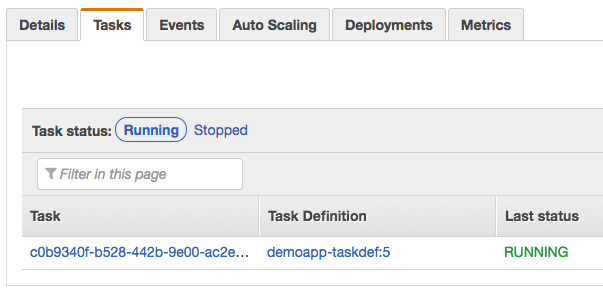

# Demo App

- Demo app is deployed to http://ecs-first-run-alb-1821305093.eu-west-2.elb.amazonaws.com
- To change/add/remove OAI endpoints see [harvest.py#L7-L10](demo-api/demoapi/resources/harvest.py#L7-L10)

## Configuration

Make sure the necessary command line tools are installed (for macOS using [Homebrew](https://brew.sh)):

```shell
brew install awscli
brew install docker
```

Setup AWS configuration access for the user `deploy`:

```
# ~/.aws/config
[profile aws-deploy]
region = eu-west-2
```

```
# ~/.aws/credentials
[aws-deploy]
aws_access_key_id = <access key for user `deploy`>
aws_secret_access_key = <secret key for user `deploy`>
```

```shell
export AWS_PROFILE=aws-deploy
```

See the [Security credentials for the `deploy` user](https://console.aws.amazon.com/iam/home?region=eu-west-2#/users/deploy?section=security_credentials) in AWS Console to revoke or create new **Access keys**, if needed.

## Develop & Deploy

Run the `./deploy.sh` deployment script at the root of the repo to:

- Build and package `demo-client`
- Create a Docker image to serve `demo-api` and `demo-client`
- Push that Docker image to AWS ECR

<details>
    <summary>Example deployment output log:</summary>

```shell
$ ./deploy.sh 
yarn install v1.3.2
[1/4] 🔍  Resolving packages...
success Already up-to-date.
✨  Done in 0.73s.
yarn run v1.3.2
$ node scripts/build.js
Creating an optimized production build...
Compiled successfully.

File sizes after gzip:

  272.46 KB (+4 B)  build/static-resources/js/main.5b5d75ab.js
  210.82 KB         build/97b61571e565ed9b8dc0.worker.js
  210.17 KB         build/static-resources/js/0.e97e681d.chunk.js
  21.83 KB          build/static-resources/css/main.cd7cf278.css

The project was built assuming it is hosted at the server root.
To override this, specify the homepage in your package.json.
For example, add this to build it for GitHub Pages:

  "homepage" : "http://myname.github.io/myapp",

The ../demo-api/build folder is ready to be deployed.
You may serve it with a static server:

  yarn global add serve
  serve -s ../demo-api/build

✨  Done in 52.76s.
WARNING! Using --password via the CLI is insecure. Use --password-stdin.
Login Succeeded
Sending build context to Docker daemon   18.8MB
Step 1/4 : FROM kennethreitz/pipenv
# Executing 3 build triggers...
Step 1/1 : COPY Pipfile Pipfile
 ---> Using cache
Step 1/1 : COPY Pipfile.lock Pipfile.lock
 ---> Using cache
Step 1/1 : RUN set -ex && pipenv install --deploy --system
 ---> Using cache
 ---> 830574db1c92
Step 2/4 : COPY . /app
 ---> 8b29fad4a255
Step 3/4 : RUN mkdir uploads
 ---> Running in ead8913716e3
 ---> 17ce288634ad
Removing intermediate container ead8913716e3
Step 4/4 : CMD ./run.sh
 ---> Running in 03571708e0fa
 ---> 7ed60fc93d53
Removing intermediate container 03571708e0fa
Successfully built 7ed60fc93d53
Successfully tagged demoapp:201711141912
The push refers to a repository [109754198917.dkr.ecr.eu-west-2.amazonaws.com/demoapp]
a61d92c57620: Pushed 
012c5d1f632c: Pushed 
96789440223b: Layer already exists 
f79c9bcce7eb: Layer already exists 
9c15ccf74da6: Layer already exists 
4222bcd1e622: Layer already exists 
cd7b58458371: Layer already exists 
4674279fa6bb: Layer already exists 
21373cf20030: Layer already exists 
eff11cc62052: Layer already exists 
1b34d79f9112: Layer already exists 
63866df00998: Layer already exists 
2f9128310b77: Layer already exists 
d9a5f9b8d5c2: Layer already exists 
c01c63c6823d: Layer already exists 
201711141912: digest: sha256:d9d12d2d2c50f18f67acea5a08f0c86724c7190653409f18acb297a444a51748 size: 3470

Docker image demoapp pushed with tag 201711141912
```
</details>

## Update AWS Service

Make note of the Docker image tag created (e.g. `201711141912`) and shown at the end of the deployment script above:

```shell
.
.
.

Docker image demoapp pushed with tag 201711141912
```

In the ECS (EC2 Container Services) section of the AWS Console, follow these steps to update the service definition to use this newly pushed Docker image tag:

1. In the [list of **Task Definitions**](https://eu-west-2.console.aws.amazon.com/ecs/home?region=eu-west-2#/taskDefinitions), **select** the one named `demoapp-taskdef` and **Create new revision**

<p align="center">
   
</p>

2. In the list of **Container Definitions** click on the link of the `demoapp` Container Name

<p align="center">
   
</p>

3. In the sliding side panel, replace the tag part of the **Image** field with the tag noted from the previous section (e.g. `201711141912`)

<p align="center">
   
</p>

4. Press **Update** to close the side panel
5. Press **Create** to create a new revision of the task definition
6. Press the **Actions** button and select the option to **Update Service**

<p align="center">
   
</p>

7. Press **Next Step** 3 times to move through steps 1–3 and on step 4 press **Update Service**
8. In the following **Launch Status** page saying “Service updated successfully” press **View Service**

Wait a minute of so until AWS switches over traffic to the new container. After a while you should see the new task definition revision launched and being the only one running:

<p align="center">
   
</p>

*Note: See also the **Events** as it is also very useful to monitor what AWS is doing during the switchover and to identify the reason for any issues that might occur.*

